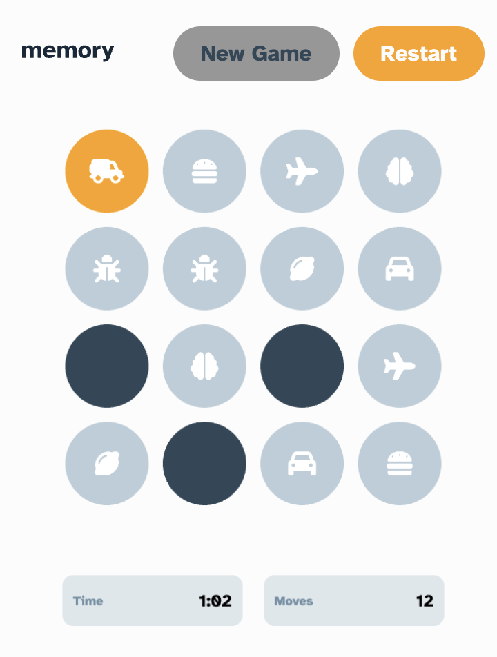

# Memory game solution

This is a solution to the [Memory game challenge on Frontend Mentor](https://www.frontendmentor.io/challenges/memory-game-vse4WFPvM).

## Table of contents

-   [Overview](#overview)
    -   [The challenge](#the-challenge)
    -   [Screenshot](#screenshot)
    -   [Links](#links)
    -   [Built with](#built-with)
    -   [How to run](#how-to-run)
-   [Author](#author)

**Note: Delete this note and update the table of contents based on what sections you keep.**

## Overview

### The challenge

Users should be able to:

-   View the optimal layout for the game depending on their device's screen size
-   See hover states for all interactive elements on the page
-   Play the Memory game either solo or multiplayer (up to 4 players)
-   Set the theme to use numbers or icons within the tiles
-   Choose to play on either a 6x6 or 4x4 grid

### Screenshot



### Links

-   Solution URL: [Here](https://github.com/elcozy/memory-game)
-   Live Site URL: [Here](demo-game-nu.vercel.app)

### Built with

-   Semantic HTML5 markup
-   CSS custom properties
-   Svelte
-   Pixi.js
-   Typescript

### How to run

```
npm install
npm run dev
```

## Author

-   Website - [Reynolds M](https://elcozy.github.io/)
-   Frontend Mentor - [@elcozy](https://www.frontendmentor.io/profile/elcozy)
